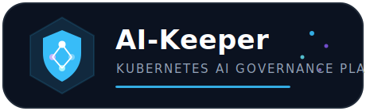
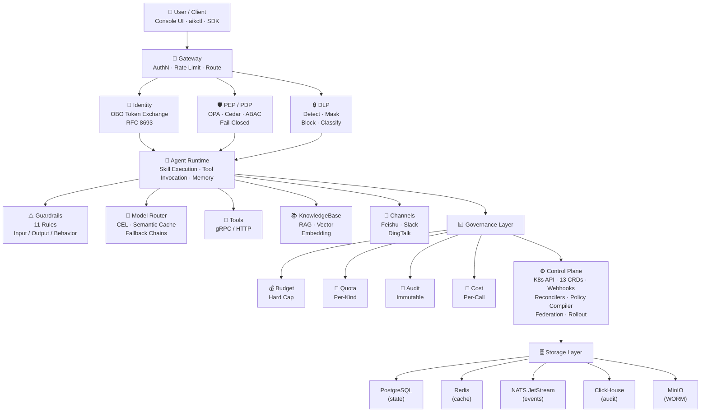
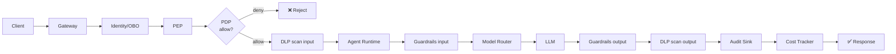
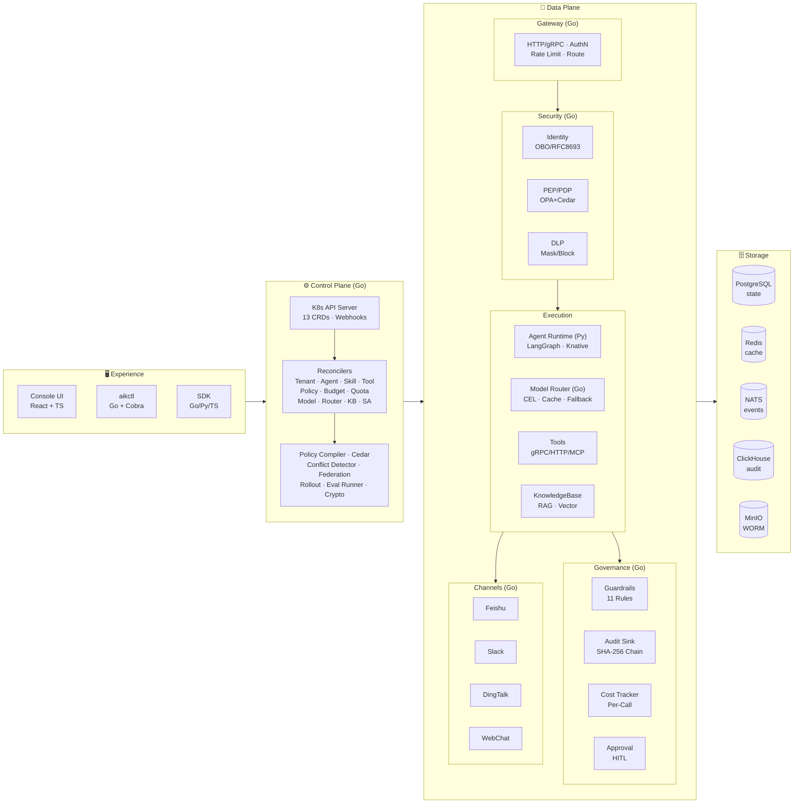

# AI-Keeper

<p align="center">
  
</p>

[](LICENSE)
[](https://goreportcard.com/report/github.com/ai-keeper/ai-keeper)
[](https://github.com/ai-keeper/ai-keeper/actions/workflows/unit.yml)

**AI-Keeper** is a Kubernetes-native, declarative AI governance platform that keeps your enterprise AI agents, skills, tools, and models safe, compliant, and cost-controlled.

You declare what you want (YAML), AI-Keeper makes it happen — with built-in identity, policy enforcement, data protection, guardrails, audit, and cost control on every AI call.

## Why AI-Keeper?

| Challenge | AI-Keeper Solution |
|-----------|-------------|
| AI agents are ungoverned black boxes | Declarative CRDs for every AI resource; reconcile into governed runtime |
| No unified auth/policy for AI calls | PEP/PDP with ABAC policies, OBO identity, fail-closed by default |
| PII leaks through LLM responses | DLP engine with detect/mask/block + classification propagation |
| No audit trail for AI decisions | Immutable audit events (ClickHouse + S3 WORM + eventHash) |
| Model costs spiral out of control | Per-call cost tracking, budget hard caps, quota enforcement |
| Deploying AI across regions is ad-hoc | Multi-region federation, cross-border routing controls |

## Architecture



### Request Flow



Every AI call passes through the full governance pipeline. Any component failure results in **deny** (fail-closed).

## Technical Architecture



### Tech Stack

| Layer | Technology |
|-------|-----------|
| Control Plane | Go 1.22+ · controller-runtime · kubebuilder · OPA · Cedar |
| Data Plane (Core) | Go · gRPC · Envoy-style pipeline |
| Agent Runtime | Python 3.11+ · LangGraph · Knative Serving |
| Model Router | Go · CEL expressions · Redis (semantic cache) |
| Console UI | TypeScript · React · pnpm |
| CLI | Go · Cobra · aikctl |
| Proto/RPC | buf · protoc-gen-go · gRPC (Go/Python/TS stubs) |
| Storage | PostgreSQL · Redis · NATS JetStream · ClickHouse · MinIO |
| Deployment | Helm 3 · Kustomize · kind (dev) · Docker |
| Testing | Go test · pytest · PBT (38 properties) · E2E (kind + mock services) |
| CI/CD | GitHub Actions · pre-commit · ruff · gofumpt · eslint · kubeconform |

## Key Features

- **13 Custom Resources** — Tenant, ServiceAccount, Skill, Tool, Agent, Policy, Budget, Quota, DataSource, KnowledgeBase, ModelEndpoint, ModelRouter, AuditEvent
- **Declarative Governance** — policies, budgets, quotas expressed as YAML; controllers reconcile
- **Fail-Closed Security** — PDP timeout → deny; DLP failure → deny; guardrail failure → deny
- **Identity & OBO** — RFC 8693 token exchange; end-user identity flows to downstream tools
- **Multi-Engine Policy** — OPA (Rego) + Cedar; conflict detection; hot-reload bundles
- **AI Guardrails** — 11 rule types across input/output/behavior with multi-provider support
- **Immutable Audit** — every AI call → one AuditEvent with SHA-256 eventHash → WORM storage
- **Model Router** — CEL-based routing, semantic cache, fallback chains, region-aware
- **Industry Packs** — pre-built skill/policy bundles for finance, healthcare, government
- **Property-Based Testing** — 38 formal correctness properties verified via PBT

## Quick Start

### Prerequisites

- Go 1.22+
- Python 3.11+ with [uv](https://docs.astral.sh/uv/)
- Node 20+ with pnpm
- Docker
- kind (for local K8s cluster)

### Setup

```bash
git clone https://github.com/ai-keeper/ai-keeper.git
cd ai-keeper

# Install dev toolchain
make bootstrap

# Run all linters
make lint

# Run unit tests
go test ./... -count=1

# Start local kind cluster + deploy
make kind-up
make e2e-up
```

### Deploy Legal Copilot Demo (30 minutes)

```bash
# Apply the reference industry pack
aikctl apply -f packs/industry/legal-copilot/manifests/

# Verify all resources become Active
kubectl get skills,agents,policies -A
```

See [docs/quickstart.md](docs/quickstart.md) for the full walkthrough.

## Repository Layout

```
api/              # CRD Go types (7 API groups, 13 Kinds)
controllers/      # controller-runtime reconcilers
internal/         # policy compiler, resolver, webhooks, federation, cedar, crypto
dataplane/        # gateway, pdp, runtime, audit, guardrail, dlp, identity, cost
proto/            # gRPC .proto definitions
cmd/              # binaries (manager, aikctl, aik-pdp, aik-gateway, aik-router, aik-audit)
config/           # CRD manifests, RBAC, kustomize
deploy/helm/ai-keeper/  # Helm chart (parent + sub-charts)
docs/             # architecture, operations guides
test/             # e2e tests
packs/            # industry packs (legal-copilot, finance, healthcare, gov-credit)
```

## Documentation

- [Architecture](docs/p2-architecture.md)
- [Getting Started](docs/quickstart.md)
- [Development Guide](docs/development.md)
- [Multi-Region Operations](docs/operations/multi-region.md)
- [Air-gapped Installation](docs/operations/airgap-install.md)
- [Cedar Policy Engine](docs/operations/cedar-engine.md)
- [Federation Setup](docs/operations/federation.md)

## Roadmap

### ✅ Delivered (v0.1)

- 13 CRDs with full validation webhooks
- Policy engine (OPA + Cedar) with conflict detection
- Budget / Quota enforcement with hard caps
- DLP engine (detect / mask / block)
- Immutable audit trail (ClickHouse + S3 WORM)
- Model Router with CEL-based routing and fallback chains
- AI Guardrails (11 rule types)
- Identity & OBO token exchange (RFC 8693)
- Multi-tenant isolation
- Industry Packs (legal, finance, healthcare, government)
- Helm chart deployment
- E2E test infrastructure

### 🚧 In Progress (v0.2)

- **Red Team Engine** — automated adversarial testing for deployed agents
- **Approval Workflows** — human-in-the-loop approval for high-risk AI actions
- **Agent Memory** — persistent conversation memory with governance controls
- **Eval Runner** — continuous evaluation of agent quality and safety metrics
- **Canary Rollout** — progressive rollout of agent/skill versions with auto-rollback

### 🔮 Planned (v0.3+)

- **Multi-Cluster Federation** — cross-cluster policy sync, marketplace sharing, disaster recovery
- **Observability Dashboard** — Grafana-based dashboards for AI call latency, cost, policy decisions
- **A/B Testing Framework** — traffic splitting between agent versions with statistical analysis
- **Compliance Reporting** — automated EU AI Act / SOC 2 / ISO 27001 compliance report generation
- **Plugin SDK** — extensible guardrail providers, DLP engines, and policy backends
- **Semantic Cache** — cross-tenant deduplication of identical LLM queries with TTL
- **Cross-Border Routing** — data residency enforcement with geo-aware model selection
- **Agent Marketplace** — publish, discover, and install governed agent packs across organizations
- **Cost Chargeback** — per-team/per-project cost allocation and showback reports
- **Drift Detection** — detect when agent behavior deviates from declared policy baseline
- **MCP Integration** — Model Context Protocol support for tool discovery and invocation
- **Multi-Cloud Model Gateway** — unified interface across AWS Bedrock, Azure OpenAI, GCP Vertex AI
- **Fine-Grained RBAC** — namespace-scoped roles with inheritance for large organizations
- **Incident Response Automation** — auto-disable agents that trigger policy violations repeatedly

## Contributing

We welcome contributions! Please read our [Contributing Guide](CONTRIBUTING.md) and [Code of Conduct](CODE_OF_CONDUCT.md) before submitting a PR.

## Security

To report a security vulnerability, please see [SECURITY.md](SECURITY.md).

## License

Apache License 2.0 — see [LICENSE](LICENSE).

## Community

- [GitHub Discussions](https://github.com/ai-keeper/ai-keeper/discussions)
- [Issues](https://github.com/ai-keeper/ai-keeper/issues)
