# AI Platform 控制器 Reconcile 状态机设计 (v1alpha1)

> 适用范围：基于 [`aip-crd-openapi.md`](./aip-crd-openapi.md) 中定义的 CRD，
> 描述 **Skill / Agent / Policy** 三个核心控制器的 Reconcile 行为、状态机、Conditions、Finalizer、错误恢复策略。
>
> 设计原则：
>
> - **声明式 + 收敛式**：所有 reconcile 都把 `status` 收敛到 `spec` 期望，幂等可重入
> - **粗粒度 phase + 细粒度 conditions**：phase 给运维看，conditions 给程序判断和编排
> - **双向健康反馈**：除事件触发外，定时 resync（默认 10 分钟）+ 健康探针（30 秒）
> - **可重入 + 幂等**：每次 reconcile 都重新读取实际状态、与期望对比，不依赖上一次内存
> - **失败有界**：所有外部依赖调用都带超时与限速重试，避免雪崩
> - **finalizer 保护**：删除必须经过编排清理路径，不允许 etcd 直删

---

## 目录

- [0. 通用约定](#0-通用约定)
- [1. Skill Controller](#1-skill-controller)
- [2. Agent Controller](#2-agent-controller)
- [3. Policy Controller](#3-policy-controller)
- [4. 三者协同视图](#4-三者协同视图)
- [5. 错误码与重试矩阵](#5-错误码与重试矩阵)

---

## 0. 通用约定

### 0.1 Phase（粗粒度，写入 `status.phase`）

| Phase | 语义 | 是否可被引用 |
|---|---|---|
| `Pending` | 资源刚创建或正在校验/解析依赖 | 否 |
| `Active` / `Running` | 期望状态已达到 | 是 |
| `Degraded` | 部分功能受损但仍可服务（SLO 不达标 / 部分 replica 不健康） | 是（带告警） |
| `Failed` | 关键步骤失败，未达期望状态 | 否 |
| `Deprecated` | 已声明 deprecation，仅维持，禁止新引用 | 仅存量 |
| `Terminating` | 正在删除，finalizer 清理中 | 否 |

> Skill 用 `Active`，Agent 用 `Running`（沿用 K8s 习惯）。

### 0.2 Conditions（细粒度）

每个 condition 结构：

```yaml
- type: <Capability>          # 可被程序断言的能力名
  status: "True"|"False"|"Unknown"
  reason: <CamelCaseReason>   # 机器可读
  message: <human readable>
  lastTransitionTime: <RFC3339>
  observedGeneration: <int64>
```

约定的 condition 命名：
- `Ready`：聚合条件，所有关键 condition 都 True 时为 True
- `<Aspect>Healthy`、`<Aspect>Validated`、`<Aspect>Resolved`、`<Aspect>Compliant`

### 0.3 Finalizer

| 资源 | Finalizer | 清理职责 |
|---|---|---|
| Skill | `ai-keeper.io/skill-protect` | 检查无 Agent 引用、解除 PDP 缓存、归档 evalSet 结果 |
| Agent | `ai-keeper.io/agent-drain` | 优雅停止会话、撤销 OAuth token、清理 channel webhook、保留审计 |
| Policy | `ai-keeper.io/policy-evict` | 通知所有 PDP 清缓存、保留最近 90 天决策快照 |

### 0.4 Reconcile 触发源

```
+---------------------------+
| 1. Watch event (CRUD)     | <-- informer
| 2. Owned resource event   | <-- Deployment/Pod/CR 子资源
| 3. Periodic resync (10m)  | <-- 兜底
| 4. Health probe (30s)     | <-- 主动探活
| 5. Manual requeue         | <-- 上游/同级控制器跨资源触发
+---------------------------+
            |
            v
       Reconcile Loop
```

### 0.5 重试与限速

- **指数退避**：base=2s, max=5min, jitter=20%
- **限速器**：per-resource workqueue.RateLimitingInterface（K8s 标准）
- **错误分类**：transient（可重试）/ permanent（标记 Failed，不重试，需人工干预）
- **配额保护**：单个 resource 在 1 小时内最多 reconcile 600 次，超出降级

---

## 1. Skill Controller

### 1.1 职责

Skill 是 **声明式契约 + 实现绑定**。控制器要做：

1. 校验 `interface`（JSON Schema 合法）和 `implementation`（runtime 可达）
2. 解析 `requires`（models / tools / dataSources / 子 skills）的引用
3. 拉取/构建 implementation 镜像（如需）
4. 注册到 Skill Registry（让 Agent 可以引用）
5. 调度 evaluation（cron）并根据 gates 自动晋升 stage
6. 监控运行时 health（来自 Agent 上报与 OTel 指标）
7. 处理 deprecation 与 sunset

### 1.2 状态机

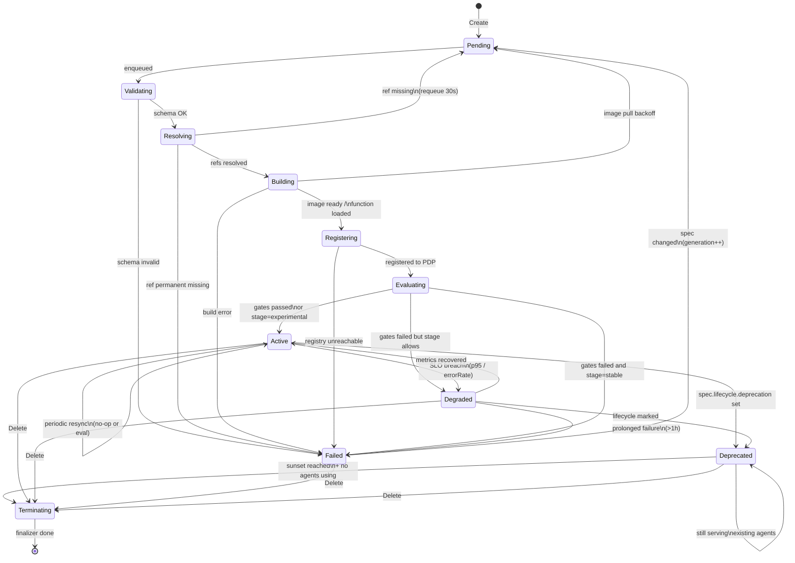

### 1.3 Conditions 矩阵

| Type | True 含义 | 触发因素 |
|---|---|---|
| `SchemaValid` | input/output JSON Schema 合法 | 校验通过 |
| `DependenciesResolved` | 所有 `requires` 引用存在且版本可解 | resolver pass |
| `ImplementationReady` | runtime 镜像已就绪 / 函数已注册 | image puller / loader |
| `Registered` | 已写入 Skill Registry，可被 Agent 引用 | registry write OK |
| `EvalPassing` | 最近一次 eval 通过 gates | eval runner |
| `SLOMet` | p95 / 成功率达标 | metrics check |
| `Deprecating` | 已进入 deprecation 阶段（不阻塞调用） | spec.lifecycle |
| `Ready` | 聚合：前面关键 conditions 全 True | derived |

> `Ready=True` 的等价式：`SchemaValid ∧ DependenciesResolved ∧ ImplementationReady ∧ Registered ∧ (EvalPassing ∨ stage=experimental)`

### 1.4 Reconcile 伪代码

```go
func (r *SkillReconciler) Reconcile(ctx context.Context, req Request) (Result, error) {
    skill := &v1alpha1.Skill{}
    if err := r.Get(ctx, req.NamespacedName, skill); err != nil {
        return ignoreNotFound(err)
    }

    // 1. 处理删除
    if !skill.DeletionTimestamp.IsZero() {
        return r.handleFinalize(ctx, skill)
    }
    if !containsFinalizer(skill, FinalizerSkillProtect) {
        addFinalizer(skill, FinalizerSkillProtect)
        return Result{Requeue: true}, r.Update(ctx, skill)
    }

    // 2. 校验 spec（可纯本地）
    if err := r.validateSchema(skill); err != nil {
        setCondition(skill, "SchemaValid", False, "InvalidSchema", err.Error())
        skill.Status.Phase = "Failed"
        return Result{}, r.Status().Update(ctx, skill)
    }
    setCondition(skill, "SchemaValid", True, "", "")

    // 3. 解析依赖
    resolved, missing, err := r.resolveRequires(ctx, skill)
    if err != nil {
        return Result{RequeueAfter: 30 * time.Second}, err
    }
    if len(missing) > 0 {
        setCondition(skill, "DependenciesResolved", False, "MissingRefs", fmt.Sprintf("%v", missing))
        skill.Status.Phase = "Pending"
        return Result{RequeueAfter: 30 * time.Second}, r.Status().Update(ctx, skill)
    }
    skill.Status.ResolvedDependencies = resolved
    setCondition(skill, "DependenciesResolved", True, "", "")

    // 4. 实现就绪
    if err := r.ensureImplementation(ctx, skill); err != nil {
        setCondition(skill, "ImplementationReady", False, classify(err), err.Error())
        if isTransient(err) {
            return Result{RequeueAfter: backoff(skill)}, nil
        }
        skill.Status.Phase = "Failed"
        return Result{}, r.Status().Update(ctx, skill)
    }
    setCondition(skill, "ImplementationReady", True, "", "")

    // 5. 注册
    if err := r.registry.Register(ctx, skill); err != nil {
        setCondition(skill, "Registered", False, "RegistryError", err.Error())
        return Result{RequeueAfter: 10 * time.Second}, nil
    }
    setCondition(skill, "Registered", True, "", "")

    // 6. 评测调度（异步）
    if r.shouldEvaluate(skill) {
        go r.runEvaluation(ctx, skill)  // 通过事件回写 status
    }

    // 7. 计算晋升 / 降级
    r.applyStagePromotion(skill)
    r.checkSLO(ctx, skill)
    r.checkDeprecation(skill)

    // 8. 写回 phase
    skill.Status.Phase = derivePhase(skill)
    skill.Status.ObservedGeneration = skill.Generation
    return Result{RequeueAfter: 10 * time.Minute}, r.Status().Update(ctx, skill)
}
```

### 1.5 关键 Reconcile 序列：依赖解析

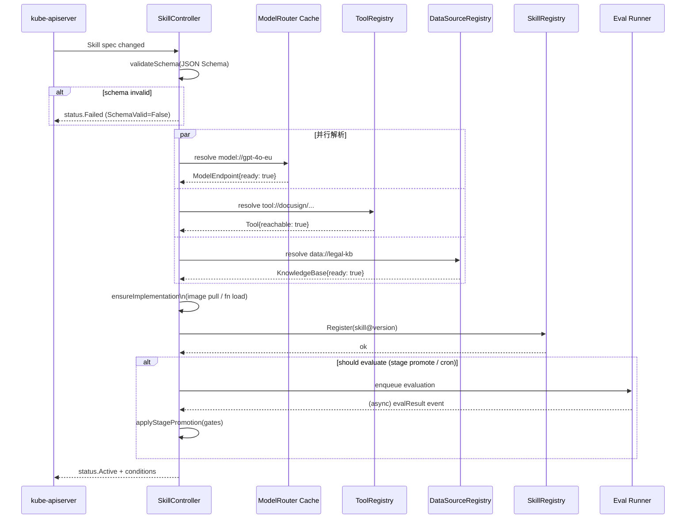

### 1.6 Finalizer 清理流程

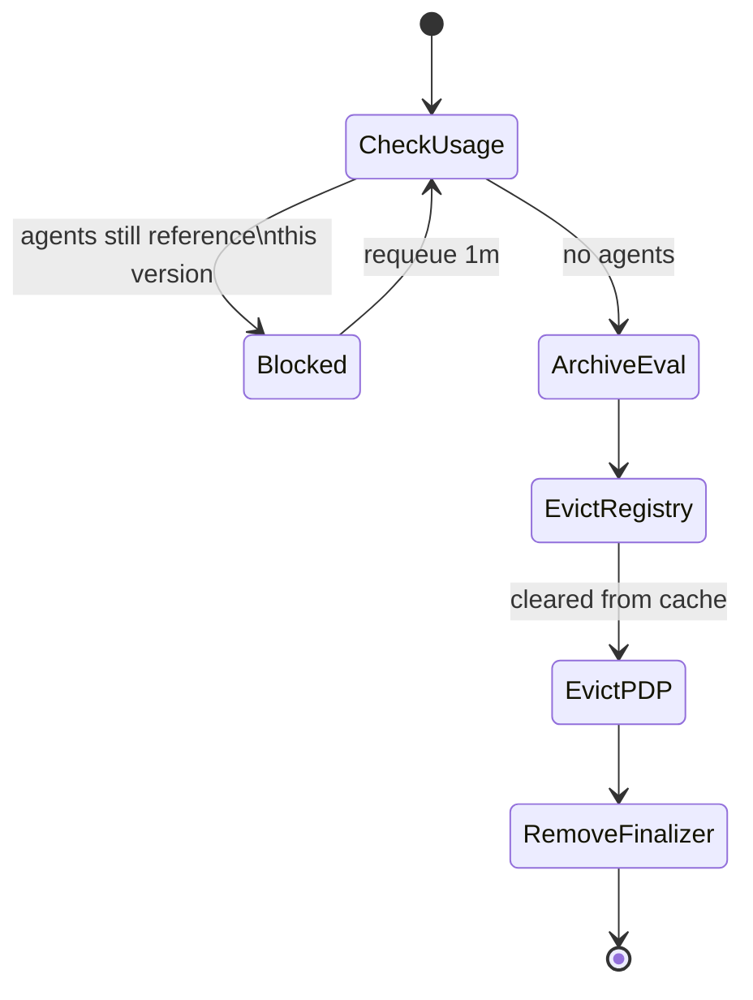

> 删除被阻塞时：发布 `SkillDeletionBlocked` 事件，告诉运维"先迁移这些 Agent"。

### 1.7 边界情况

| 场景 | 处理 |
|---|---|
| 上游 Model 切换 region（合规） | dependency change 触发 reconcile，Active → Degraded → Active（更新 resolvedDependencies） |
| evalSet 缺失但 stage=stable | condition `EvalPassing=Unknown`，phase=Degraded（warn 但不阻塞） |
| 同一 Skill 两个 version 并存 | 不冲突，每个 version 一个 CR，Agent 通过 `versionConstraint` 选 |
| 依赖循环（Skill A 依赖 B 依赖 A） | 解析阶段拓扑排序检测，标 Failed/CyclicDependency |
| 镜像签名校验失败 | Failed/ImageSignatureInvalid，不重试 |

---

## 2. Agent Controller

### 2.1 职责

Agent = "可对外服务的运行实例"。控制器要做：

1. 校验 spec、解析 skills 版本、解析 policies
2. 创建/更新 Deployment（含 sandbox）、HPA、ServiceAccount Token
3. 注入运行时配置（systemPrompt、guardrails、budget、memory）
4. 配置 channels（飞书 webhook、Web endpoint、API gateway 路由）
5. 灰度发布（canary / blue-green）+ 自动分析
6. 健康监控（replicas、SLO、guardrail 触发率）
7. 优雅下线（drain sessions、revoke tokens、注销 channel）

### 2.2 状态机

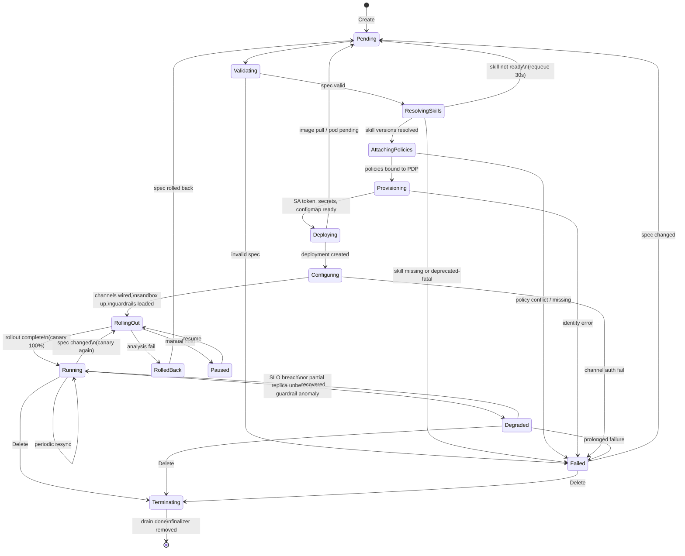

### 2.3 Conditions 矩阵

| Type | True 含义 |
|---|---|
| `SpecValid` | 字段校验通过 |
| `SkillsResolved` | 全部 skills 引用可解，写入 status.attachedSkills |
| `PolicyAttached` | 已注册到 PDP，可被授权决策 |
| `IdentityReady` | ServiceAccount 与 token exchanger 就绪 |
| `Deployed` | Deployment ready replicas == desired |
| `ChannelsHealthy` | 所有 channels 可达（飞书 webhook 200 OK 等） |
| `GuardrailsHealthy` | 所有 guardrail provider 在线 |
| `SandboxReady` | sandbox runtime 就绪（如启用） |
| `RolloutComplete` | 灰度结束，100% 流量 |
| `BudgetWithinLimit` | 当期预算未超 |
| `Ready` | 聚合 |

### 2.4 Reconcile 关键阶段

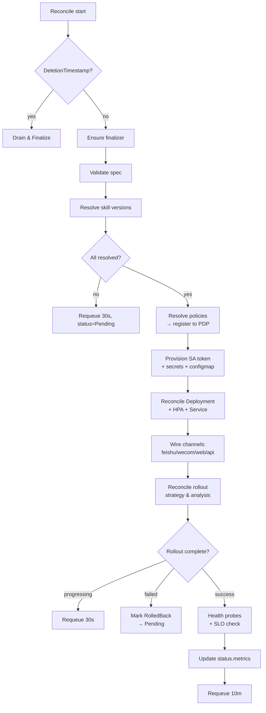

### 2.5 灰度发布子状态机

Agent 与"模型/Skill"一样需要灰度。子状态机独立运转：

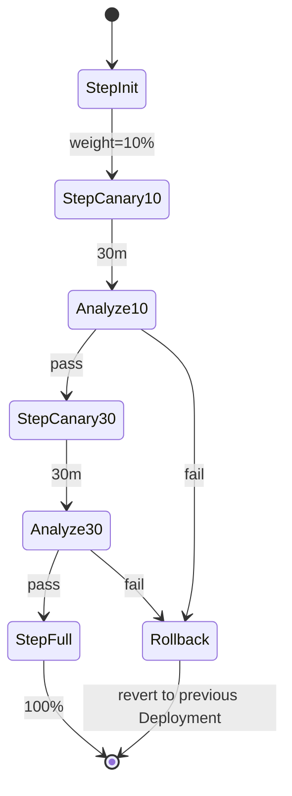

**分析维度**（来自 OTel 指标 + 审计事件）：
- 错误率对比（canary vs stable，差值 > 阈值即 fail）
- p95 延迟对比
- guardrail 触发率
- 用户反馈分（thumbs up/down）
- 成本对比（USD/请求差值）

### 2.6 Drain & Finalize 流程

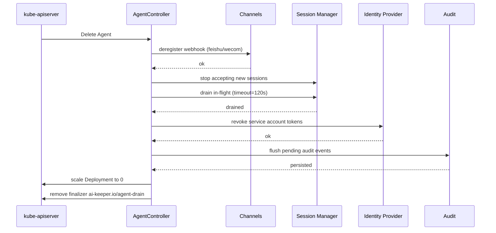

> drain 超时（默认 5 分钟）后强制 kill，但**审计事件必须先持久化**才允许 finalizer 移除。

### 2.7 边界情况

| 场景 | 处理 |
|---|---|
| 引用的 Skill 进入 deprecated | 不阻塞，但 conditions 加 `UsingDeprecatedSkill=True`，触发告警 |
| skill 版本约束无法满足 | Failed/UnsatisfiableConstraint，事件提示用户放宽约束 |
| budget.onExceed=terminate 触发 | 状态进入 Degraded（BudgetExhausted），下一周期自动恢复 |
| guardrail provider 全部离线 | 默认 fail-closed：Agent 进入 Degraded，新会话拒绝 |
| sandbox runtime 不可用且 spec 要求 | Failed/SandboxUnavailable（合规硬约束，不可降级） |
| 跨 namespace 引用未授权 | Failed/CrossNamespaceDenied |

---

## 3. Policy Controller

### 3.1 职责

Policy Controller 是**纯控制平面**——它不创建工作负载，只做：

1. 语法校验（CEL 表达式、Schedule、CIDR、引用合法）
2. 引用校验（subject / resource selector 是否能命中至少一个对象）
3. 冲突检测（同 priority 的 allow/deny 在相同 selector 上重叠）
4. 编译为 PDP 的执行格式（Rego / Cedar AST）
5. 分发到所有 PDP 实例（gateway sidecar、独立 PDP service）
6. 监控决策指标（allow/deny/approval 数）
7. 时间窗到期后自动失效

### 3.2 状态机

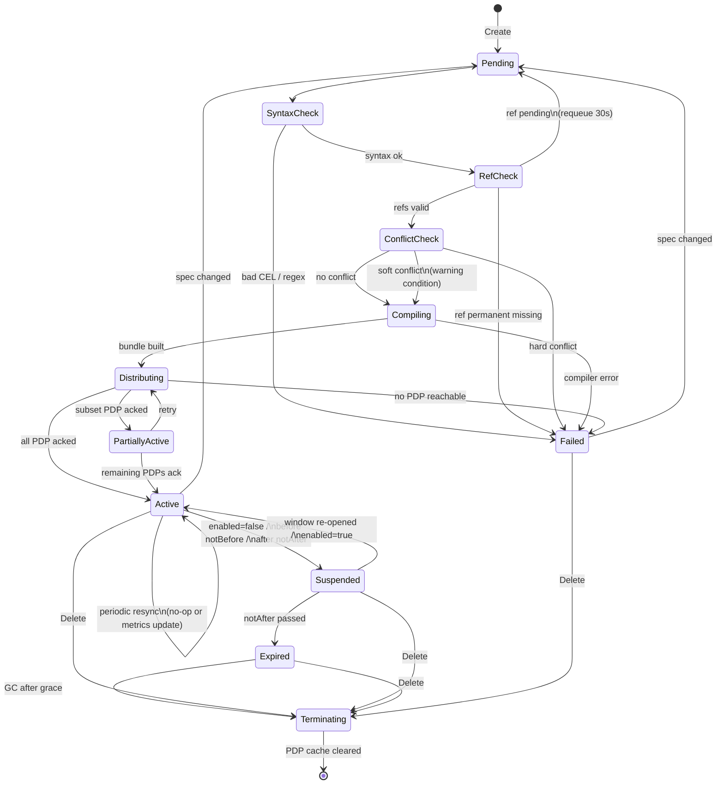

### 3.3 Conditions 矩阵

| Type | True 含义 |
|---|---|
| `SyntaxValid` | CEL / cron / CIDR 等语法合法 |
| `ReferencesResolved` | subject 与 resource selector 可命中 ≥ 0 对象（空命中允许，但提示） |
| `NotConflicting` | 与同 priority 的其它策略无 hard conflict |
| `Compiled` | 已编译为 PDP 可执行格式 |
| `Distributed` | 至少一个 PDP 实例已加载 |
| `FullyDistributed` | 所有期望 PDP 都已加载 |
| `WithinEffectiveWindow` | 当前时间在 effectiveWindow 内 |
| `Active` | enabled && WithinEffectiveWindow && Distributed |
| `Ready` | 聚合 |

### 3.4 Reconcile 序列

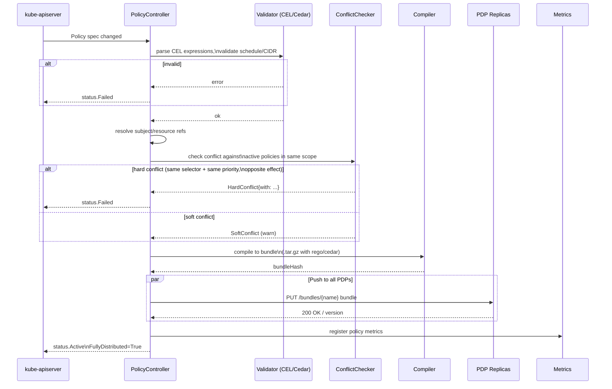

### 3.5 冲突检测算法（核心难点）

冲突的定义：

| 类型 | 描述 | 处理 |
|---|---|---|
| Hard | 同 priority + 完全重叠 selector + 相反 effect | Failed |
| Soft | 同 priority + 部分重叠 selector + 相反 effect | Warn condition |
| Shadow | 高 priority allow 完全覆盖低 priority deny（或反之） | Warn condition |
| Redundant | 同 priority + 同 effect + 完全重叠 selector | Warn condition |
| Tautology | conditions 永远为 true 或永远 false | Warn condition |

实现思路：把每条 Policy 投影成 (subject_set, resource_set, effect, priority) 的空间区域，
做集合相交分析。subject/resource 的展开用 selector 求值（label/attr 匹配 + 命名匹配）。
对于 CEL 条件，做静态可满足性分析（SMT 不必跑全，工程上做语法启发式即可）。

### 3.6 时间窗调度

`effectiveWindow` 不是一次性判定，而是**调度任务**：

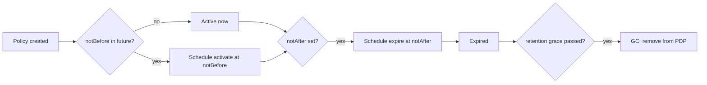

控制器维护一个**时间堆**，下一个跳变事件触发时被唤醒，避免每秒扫描。

### 3.7 PDP 分发可靠性

PDP 是**可多副本**的执行点（gateway sidecar / 独立 service）。控制器要保证：

| 保证 | 实现 |
|---|---|
| 至少一次送达 | 每次 distribute 都带 bundleHash + version，PDP 持久化后回 ack |
| 顺序性 | 通过 monotonic version，PDP 拒绝旧版本 |
| 全量收敛 | 周期性对账：列出所有 PDP 当前 bundleHash，发现 drift 即重新 push |
| 失败隔离 | 单个 PDP 失败不影响其他；多数派达成即标 PartiallyActive |
| 故障感知 | PDP 心跳 30s，丢失 3 次踢出 active set，复活后重 push |

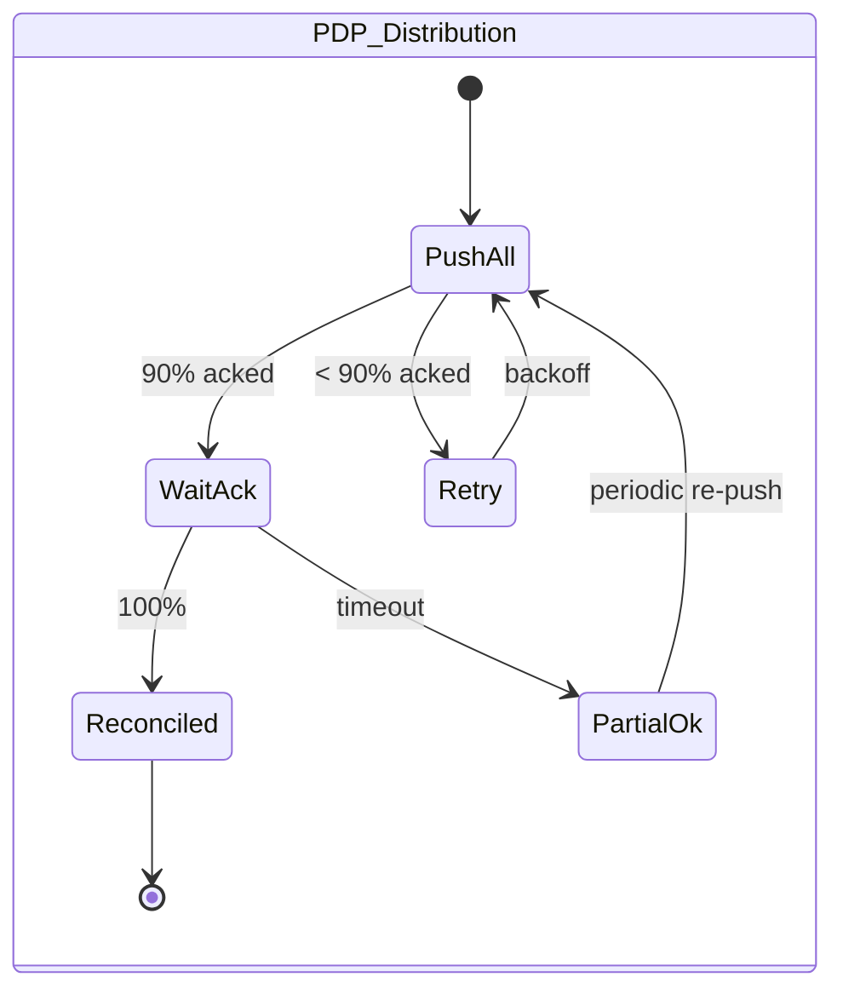

### 3.8 边界情况

| 场景 | 处理 |
|---|---|
| Policy 删除时仍有进行中的决策 | finalizer 等待 in-flight 决策落库（最多 30s）后再清缓存 |
| Policy 引用了已删除的 Role / Group | conditions 加 `OrphanReferences=True`，效果上该子句永不命中（fail-closed） |
| 批量导入大量 policy 导致 PDP 内存压力 | 编译 bundle 时分片（每 1000 条一个 bundle），PDP 增量加载 |
| 高频 spec 变更（每秒多次） | 控制器内合并：500ms 内的更新合并为一次编译 + 分发 |
| effectiveWindow 已过期但 enabled=true | phase=Expired，不参与决策；spec 不自动改 |
| 网络分区导致 PDP 不一致 | 客户端必须**fail-closed**：未拿到决策即拒绝；不允许默认 allow |

---

## 4. 三者协同视图

三个控制器之间通过事件 + watch 协作（不直接 RPC）：

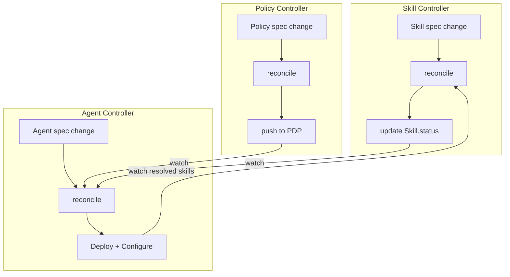

**协同关键点**：

| 触发关系 | 说明 |
|---|---|
| Skill.status.phase: Active → Agent 重新解析 | Agent 通过 watch Skill informer 触发 reconcile |
| Skill 进入 Deprecated → Agent 标 UsingDeprecated | 不阻塞，但走告警 |
| Policy 变更 → Agent 不需要重新部署 | PDP 已经接收新策略，Agent 下一次决策时即生效 |
| Agent 创建/删除 → Skill 引用计数变化 | Skill controller 维护 `status.referencingAgents`，删除阻塞依据 |
| Policy 删除 → Agent 仍可运行 | 决策时该 policy 不再命中即可，无需 Agent 介入 |

**事件总线（可选）**：除 K8s watch 外，还可用 NATS / Kafka 发布领域事件
（`SkillPromoted`、`PolicyDistributed`、`AgentDeployed`），供平台前端、计费、审计模块订阅。

---

## 5. 错误码与重试矩阵

统一错误分类，用于 condition.reason 与日志：

| Reason | 类别 | 重试 | 默认动作 |
|---|---|---|---|
| `InvalidSchema` | permanent | no | Failed |
| `MissingReference` | transient(短期)/permanent(长期) | yes(初始)/no(超 1h) | Pending → Failed |
| `RegistryUnreachable` | transient | yes (exp backoff) | Pending |
| `ImagePullBackOff` | transient | yes | Pending |
| `ImageSignatureInvalid` | permanent | no | Failed |
| `EvaluationFailed` | logical | depends on stage | Degraded(experimental) / Failed(stable) |
| `SLOBreached` | runtime | continuous monitor | Degraded |
| `BudgetExhausted` | runtime | period reset | Degraded |
| `IdentityProviderError` | transient | yes | Pending |
| `PDPDistributeError` | transient | yes | PartiallyActive |
| `PolicyConflict` | logical | no | Failed |
| `RolloutAnalysisFailed` | runtime | rollback | RolledBack |
| `SandboxUnavailable` | infra | yes (limited) | Failed if exceeds |
| `CrossNamespaceDenied` | permission | no | Failed |
| `CyclicDependency` | permanent | no | Failed |

**重试策略统一**：

```
attempt N: delay = min(base * 2^N, max) * (1 + jitter)
  base   = 2s
  max    = 5m
  jitter = ±20%
  cap    = 24h（超过即停止重试，标 Failed/PermanentlyStuck）
```

---

## 6. 实现建议

1. **使用 controller-runtime**：标准 K8s Operator 框架，自带 workqueue、informer、leader election
2. **Status 与 Spec 严格分离**：所有 reconcile 只写 status subresource，避免与用户写 spec 冲突
3. **使用 CEL 做 status condition 表达**：把"何时为 Ready"用 CEL 写在 CRD 的 `x-kubernetes-validations`，前后端一致
4. **每个 reconcile 必须 ≤ 30 秒**：长任务（eval、image build）拆成异步 job，通过事件回写
5. **观测三件套**：metric（reconcile 次数、延迟、错误）、log（结构化、带 traceId）、event（K8s Event，给 kubectl describe 看）
6. **测试**：用 envtest 跑集成测试，覆盖：正常路径、依赖缺失、超时、删除、灰度回滚、并发更新

---

## 7. 后续可扩展

- **Tool / DataSource / KnowledgeBase / ModelEndpoint** 控制器：状态机相对简单（连通性 + 配额 + 数据漂移），可参考本文风格补齐
- **Tenant** 控制器：负责创建 namespace、注入默认 budget/quota、初始化 Connector 模板
- **AuditEvent** 没有控制器：由系统组件直接写入 ClickHouse + S3，CRD 仅作为只读门面
- **ConversionWebhook**：v1alpha1 → v1beta1 → v1 的字段迁移规则，每次 GVR 升级独立实现

---

## 文档版本

| 版本 | 日期 | 说明 |
|---|---|---|
| v1.0 | 2026-05-26 | Skill / Agent / Policy 三个核心控制器的状态机、Conditions、Reconcile 流程、错误恢复策略 |
