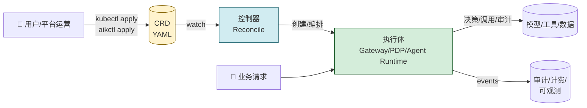
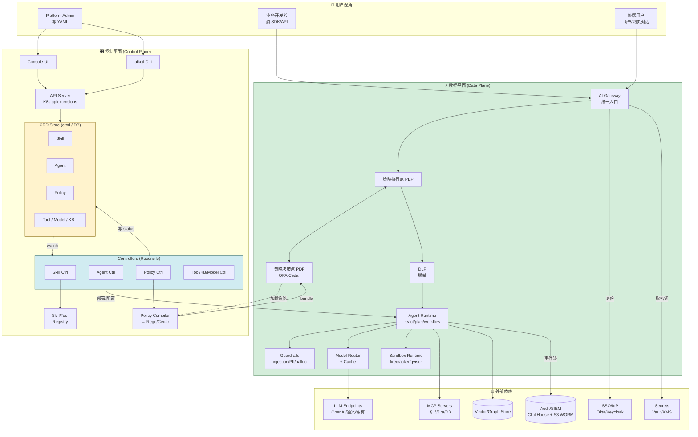
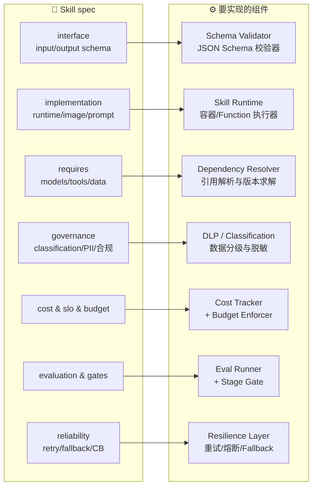
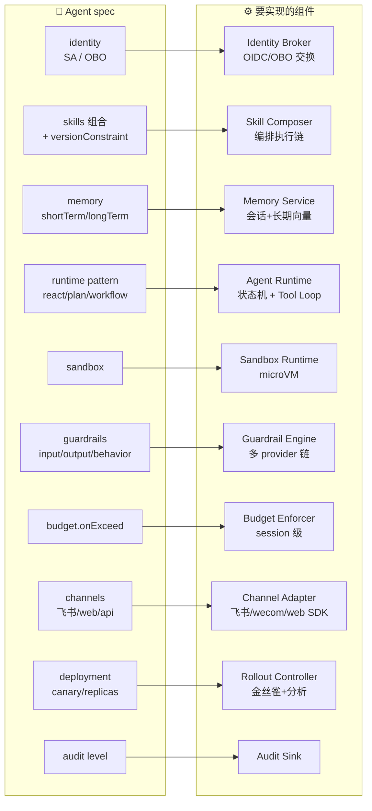
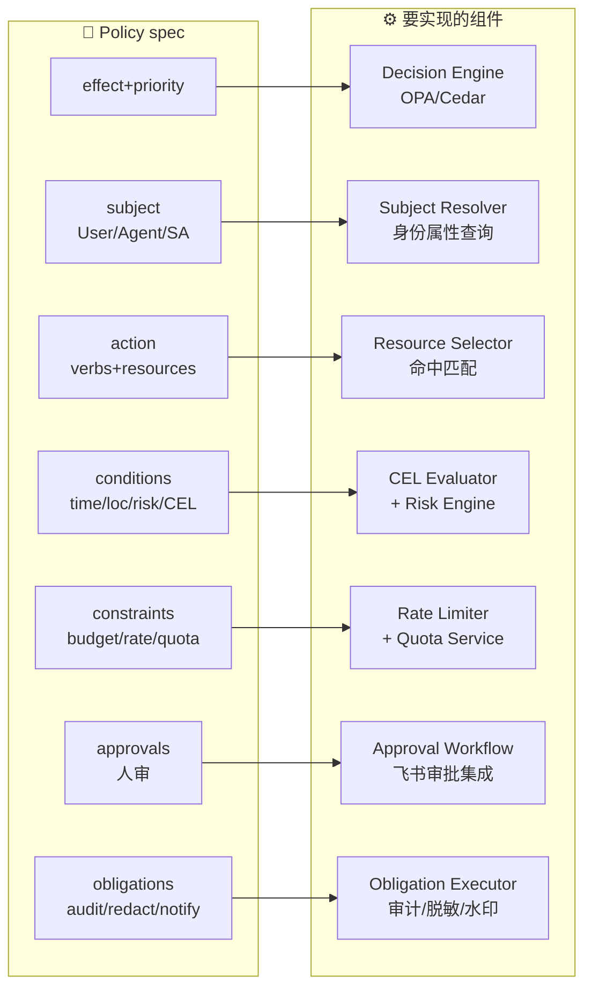
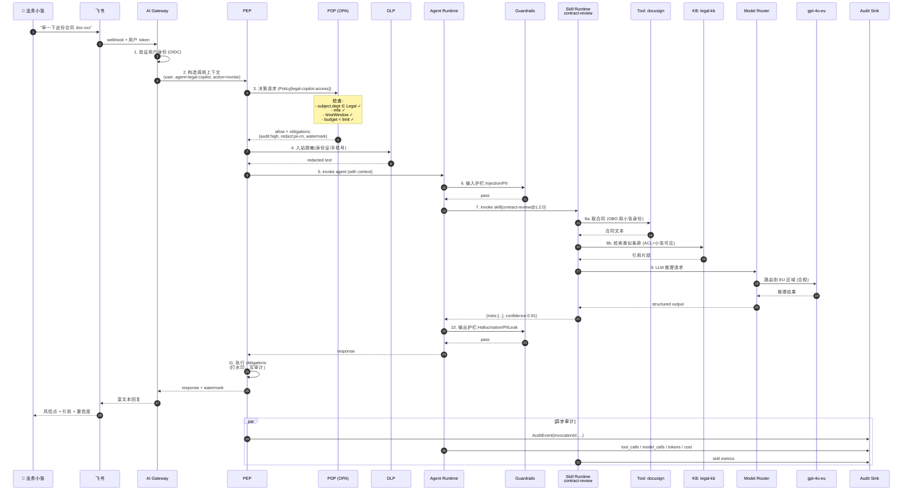
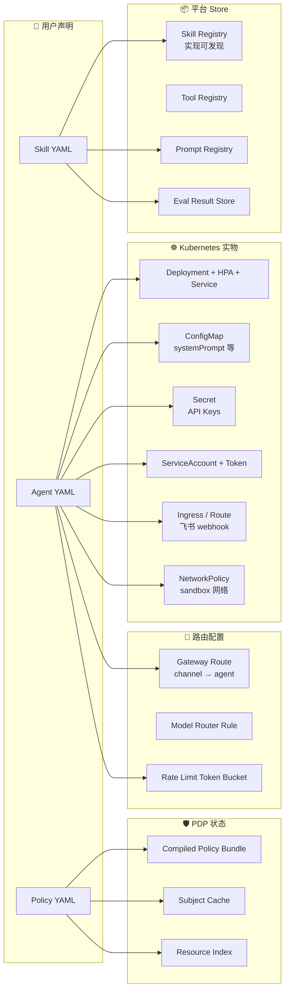
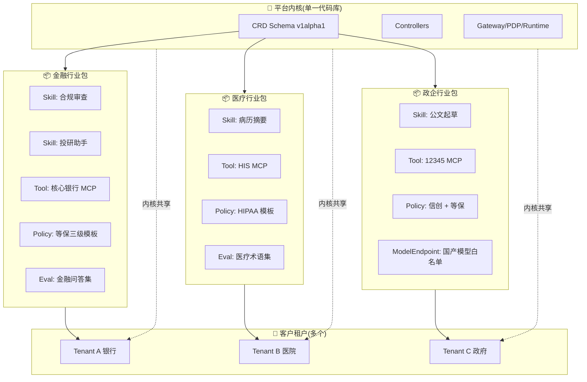
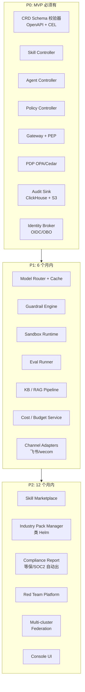

# AI Platform 是什么 —— 用图讲清楚 "CRD/Schema 到底要实现啥"

> 你之前已经有了 [`aip-crd-openapi.md`](./aip-crd-openapi.md)（CRD schema）和 [`aip-controllers-reconcile.md`](./aip-controllers-reconcile.md)（控制器状态机）。
> 这一篇是**导览图**：把 schema 放回到整个产品里看，让你一眼明白"这堆 YAML 字段最终要变成什么系统、解决什么问题"。

---

## 1. 一句话先定调

> **CRD 是产品的 "API"，控制器是产品的 "运行时"，PDP/Gateway/Runtime 是产品的 "执行体"。**
>
> 用户写 YAML（声明意图）→ 控制器把它变成可运行的系统 → 数据面在每次调用时执行 schema 里写好的"规矩"。



**这个产品最终交付什么？**

| 层 | 交付物 | 类比 |
|---|---|---|
| L1 描述层 | CRD/OpenAPI Schema | "宪法 / API 合同" |
| L2 控制层 | 控制器 + Reconcile | "立法机关 / 政府办公厅" |
| L3 数据层 | Gateway + PDP + Agent Runtime + Vector/Audit Store | "公检法 / 执法部门" |
| L4 体验层 | CLI / Console / SDK | "办事大厅" |

---

## 2. 产品全貌（一张图看完整体）



**关键认知**：

- **CRD 在最上面**——用户能看到的就是它，所有功能都从这里"声明"
- **Controllers 在中间**——把 YAML 翻译成"实际运行的系统"
- **Gateway/PDP/Runtime 在最下面**——真正处理每一次 AI 调用，并且它们的"行为"完全由上面的 CRD 决定

---

## 3. CRD 字段 → 系统能力的映射（最关键的一张图）

很多人看 schema 觉得"字段好多没必要"，但每一组字段都对应一个**真实的运行时组件**。下面这张图把 schema 的每一段映射到具体要实现的服务。







> **看出门道了吗？**
> 每一个 schema 字段背后,都对应一个"必须开发的服务"。schema 写得越完整,产品边界就越清晰。
> 没有这套 schema,你可能要写 50 份散落的 PRD;有了它,产品 backlog 一目了然。

---

## 4. 一次真实调用的端到端流程

把所有抽象拉到一个具体场景：**法务小张在飞书里问"帮我审一下这份合同"**。



**这张图里每一个箭头都对应 schema 里的一段配置**：

| 步骤 | 对应 schema 字段 |
|---|---|
| ① 验身份 | `Agent.identity.serviceAccount` + IdP 配置 |
| ② 上下文 | `Agent.identity.representation.mode = on_behalf_of` |
| ③ 决策 | `Policy.{subject, action, conditions, constraints}` |
| ③ obligations | `Policy.obligations.{audit, redact, watermark}` |
| ④ DLP | `Skill.governance.pii.onInput` |
| ⑥⑩ 护栏 | `Agent.guardrails.{input, output}` |
| ⑦ skill 解析 | `Agent.skills[].versionConstraint` + `Skill.implementation` |
| ⑧ tool/KB | `Skill.implementation.requires.{tools, dataSources}` |
| ⑨ 路由 | `ModelRouter.rules` + `ModelEndpoint.region` |
| ⑪ 审计 | `Agent.audit.level` + `Policy.obligations.audit` + `AuditEvent` CRD |

> 你现在能直观看到：**schema 不是文档，schema 就是这条链路的"接线图"**。
> 控制器把 YAML 编译进来，调用时数据面照着执行。

---

## 5. 控制器把 YAML 变成什么？(声明 → 实物的转化)



> 这就是"声明式平台"的精髓——**用户只描述意图，控制器制造一切**。
>
> 你做的工作量是"实现 X 个控制器"，而不是"为每个客户写 X 个集成"。

---

## 6. 多租户视角：一份 schema，百家公司用

通用产品最大的难点是**让同一份内核服务多个行业 / 客户 / 合规域**。schema 在这里起到关键作用：



**关键事实**：

- 内核 = 一份代码、一份 CRD、一份控制器
- 行业包 = 一组**预填好的 CR（YAML）**，套同一个 schema
- 客户租户 = 装一个或多个行业包 + 自定义补充
- 这意味着：**schema 不变，产品就稳定；行业适配靠加 YAML 包，不改代码**

这就是为什么 CRD/Schema 设计要花最多时间——**一旦发布就是产品的脊柱，不能轻易变**。

---

## 7. 围绕 schema 要建的工程能力（开发清单）

把 schema 落地需要建的能力,按优先级排：



> **顺序很重要**:
> 先把 P0 跑通(声明 → 控制器 → Gateway → PDP → 审计),哪怕 Skill 只支持最简单的一种实现也没关系。
> P1 是把"可用"扩到"够用"。
> P2 才是"产品化、商品化、生态化"。

---

## 8. 三句话总结

如果只能记三件事:

1. **CRD/Schema 不是文档,是产品的合同**——它定义了"用户能声明什么,平台必须实现什么",每一个字段都对应一个要写的服务。
2. **控制器是合同的执行机关**——把 YAML 翻译成 Deployment、Policy Bundle、路由规则这些"实物",并持续把实际状态向期望状态收敛。
3. **Gateway + PDP + Runtime 是最终的执法者**——每一次真实的 AI 调用都按 CRD 里写好的规矩执行:谁能调、走哪个模型、怎么审计、怎么计费,全部由 schema 决定。

```
用户写 YAML
    ↓
控制器 reconcile
    ↓
真实可用的 AI 平台
    ↓
合规、可审、可控、可降本
```

---

## 9. 推荐阅读顺序

如果你或团队成员要快速理解这套设计:

1. **本文**(`aip-overview.md`) ← 你在这里 🟢 先看图,建立心智
2. [`aip-crd-openapi.md`](./aip-crd-openapi.md) — 看具体字段,理解每个字段在第 3 节图里对应什么组件
3. [`aip-controllers-reconcile.md`](./aip-controllers-reconcile.md) — 看控制器怎么把 YAML 变成实物
4. (待写) `aik-gateway-pep-pdp.md` — 看数据面具体的执行机制
5. (待写) `aip-industry-packs.md` — 看行业包怎么组织和分发

---

## 文档版本

| 版本 | 日期 | 说明 |
|---|---|---|
| v1.0 | 2026-05-26 | 用 9 张图把 CRD/Schema 在产品中的位置、作用、要实现的组件、端到端调用链、多租户与行业包机制讲清楚 |
